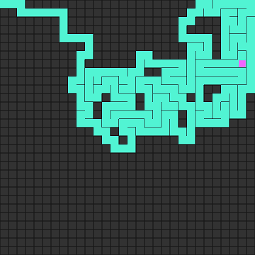
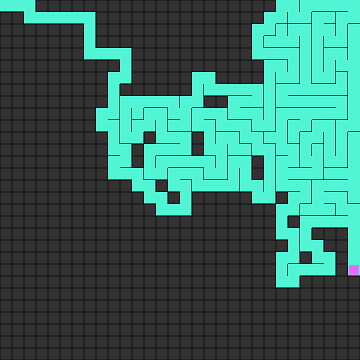
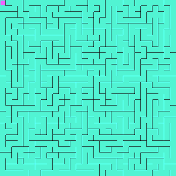
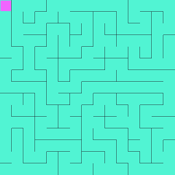
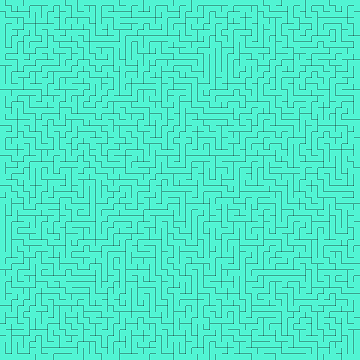

# Maze Generator

#### Maze generation animation using Depth First Search (recursive backtracking) algorithm. 🙂

It's Animating otherwise it only take a split second for even 1000x1000 grid.😌

Inspired by [@daniel shiffman](https://github.com/CodingTrain)
It's so satisfying to see it creating, isn't it?😍

Go and visit the [link](https://amishranpariya.github.io/maze_generator/) to see it live.🎉🥳
PS: hit spacebar when done to download your very own maze and try to solve it if you are on PC using arrow keys.

For mobile users double tap to download maze.👍🏻

#### Examples

> Happy coding🥰
